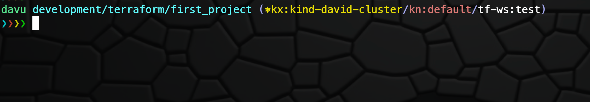

# New oh-my-zsh theme 

A bit simpler than the other (dv-2 theme). 

Show prompt info for:
* Kubernetes context
* Kubernetes namespace
* Terraform workspace
* git-branch and info about if it´s not "clean"

# Installation

## Option A
* Clone this repo to your `~/.oh-my-zsh/custom/themes`-folder
  * it will add a `dv3-theme` folder and this folder will contain the `dv3.zsh-theme`-file
* `cd` into that folder and move that file one folder up so it will end up in `~/.oh-my-zsh/custom/themes`
* modify your `~/.zshrc`-file with an editor your like and set `ZSH_THEME="dv3"`
* save and exit `~/.zshrc`
* on your shell execute `source ~/.zshrc`

## Option B:
* copy the content of the `dv3.zsh-theme`-file
* paste it in a file under the `~/.oh-my-zsh/custom/themes`-folder
  * make sure the file has the `.zsh-theme`-ending. For example: `mytheme.zsh-theme`
* modify your `~/.zshrc`-file with an editor your like and set `ZSH_THEME="mytheme"`
* save and exit `~/.zshrc`
* on your shell execute `source ~/.zshrc`

Company stile prompt on a new line looks smoother.
